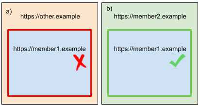

# GDPR Validated Sets

This document proposes a new web platform mechanism (primitive) to declare a collection of domains that have been owner
certified by [notaries](https://www.thenotariessociety.org.uk/pages/what-is-a-notary) or are associated with extended
validation SSL certificates that provide proof of legal ownership ("Validated Domains"), are sole or
[joint controllers](https://ico.org.uk/for-organisations/guide-to-data-protection/guide-to-the-general-data-protection-regulation-gdpr/controllers-and-processors/what-does-it-mean-if-you-are-joint-controllers/) 
as defined by GDPR, and share a common use policy as being in a "GDPR Validated Set" (or "Set" for brevity).

**Note:** GDPR has been picked as the first legal framework to comply with. Other frameworks should be added iteratively
after a proposal that meets the requirements of GDPR has been created. This approach enables a multi stage approach to 
review and debate without attempting to solve for all legal frameworks in a single iteration.

A [Work Item](https://privacycg.github.io/charter.html#work-items)
of the [Privacy Community Group](https://privacycg.github.io/).

## Editors:

**Note:** To be updated depending on response to the revised proposal.

- [Kaustubha Govind](https://github.com/krgovind), Google
- [Harneet Sidhana](https://github.com/HarneetSidhana), Microsoft 

## Participate

**Note:** To be updated depending on response to the revised proposal.

- https://github.com/privacycg/first-party-sets/issues

# Table of Contents

<!-- START doctoc generated TOC please keep comment here to allow auto update -->
<!-- DON'T EDIT THIS SECTION, INSTEAD RE-RUN doctoc TO UPDATE -->


- [GDPR Validated Sets](#gdpr-validated-sets)
  - [Editors:](#editors)
  - [Participate](#participate)
- [Table of Contents](#table-of-contents)
- [Introduction](#introduction)
- [Goals](#goals)
- [Out of Scope](#out-of-scope)
- [Use Cases](#use-cases)
- [Establishing Ownership](#establishing-ownership)
- [Defining Sets](#defining-sets)
- [The Problem of Consent](#the-problem-of-consent)
- [Evaluating Sets](#evaluating-sets)
  - [Writing](#writing)
  - [Reading](#reading)
- [UI Treatment](#ui-treatment)
- [Domain Schemes](#domain-schemes)
- [Privacy Considerations](#privacy-considerations)
  - [Probabilistic Identifiers (aka Fingerprinting)](#probabilistic-identifiers-aka-fingerprinting)
  - [Data Protected Authorities](#data-protected-authorities)
- [Alternative designs](#alternative-designs)
  - [First Party Sets](#first-party-sets)
  - [Signed Assertions and set discovery instead of static lists](#signed-assertions-and-set-discovery-instead-of-static-lists)
  - [Origins instead of registrable domains](#origins-instead-of-registrable-domains)
- [Prior Art](#prior-art)
- [Acknowledgements](#acknowledgements)
- [Appendix](#appendix)
  - [SameParty Cookies and First-Party Sets](#sameparty-cookies-and-first-party-sets)

<!-- END doctoc generated TOC please keep comment here to allow auto update -->

# Introduction

Browsers have proposed a variety of tracking policies and privacy models
([Chromium](https://github.com/michaelkleber/privacy-model/blob/master/README.md),
[Edge](https://blogs.windows.com/msedgedev/2019/06/27/tracking-prevention-microsoft-edge-preview/),
[Mozilla](https://wiki.mozilla.org/Security/Anti_tracking_policy),
[WebKit](https://webkit.org/tracking-prevention-policy/)) which scope access to user identity to some notion of domain 
name displayed in the address bar of the browser (aka first-party). In defining this scope, we must balance two goals: 
the scope should be small enough to meet the user's privacy expectations, yet large enough to provide the user's desired
functionality on the site(s) they are interacting with.

One natural scope is the domain name in the top-level domain. However, the website the user is interacting with may be
deployed across multiple domain names. For example, `https://google.com`, `https://google.co.uk`, and 
`https://youtube.com` are owned by the same entity, as are `https://apple.com` and `https://icloud.com`, or 
`https://amazon.com` and `https://amazon.de`, or `https://disney.es`, `https://disney.com`, `https://espn.com`, and 
`https://hulu.com`, or `https://dove.com` and `https://axe.com`.

We wish to allow user agent data sharing to span multiple domains and origins only when the following conditions are 
met;

-  where the legal ownership of the registerable domain can be established by the user;
-  where legal owner(s) of the registerable domain processing data as either a single controller or joint controllers 
   under GDPR;
-  that share a common use policy which incorporates a GDPR compliant privacy policy; and
-  where the user has consented to the common use policy.

For example, Firefox ships an [entity list](https://github.com/mozilla-services/shavar-prod-lists#entity-list)
that defines lists of domains belonging to the same organization. This proposal discusses a mechanism to enable single 
and joint controllers to share data without declaring a list of domains that are administered and policed by the user 
agent vendor. Instead the user agent can inspect and verify Sets on behalf of users without the need for a centralized
authority.

**Note:** Domains and company names used as examples have been provided only to serve as real-world illustrative assumed
examples of collections of domains that are owned by the same organization or share the same use policy; and have not
all been validated with the owners.

# Goals

Enables;

-  innovation concerning consent, data use, and service provision to occur across the broadest group of web participants 
   no longer restricting such innovation to implementors of user agents alone.
-  Validated Domains (VD) to declare themselves as being in the same Set.
-  the user to consent to common use policies rather than on a per domain basis.
-  browsers to understand the relationships between data controllers and domains such that they can effectively present
   that information to the user.
-  browsers to understand the consent choices of users to better capture and respect their preferences.
-  existing justice systems to be used to identify and sanction bad actors under laws.

When delivered as a web primitive Sets support, simplify, and align to GPDR, other explainers and proposals including 
[Privacy Sandbox](https://www.chromium.org/Home/chromium-privacy/privacy-sandbox).

# Out of Scope

This proposal is intended to establish the principles and concepts associated with data sharing under GDPR within the 
user agent. It does not yet provide concrete implementation details. The following are not currently within the scope of
the proposal.

-  Indicating cookies that should be read or written from the Set rather than other locations. This might be achieved 
   using the Same-Site attribute in further development.
-  Relationship to other proposals or specifications.
-  Legal or logic conflicts between different use policies accepted by the user and applied to the same Set. Where such 
   conflicts exist the transparency of the solution will enable this to be identified and the data controller(s) 
   informed.
-  Consideration of legal frameworks other than GDPR. Once a proposal that meets GDPR has been achieved other legal
   frameworks can be overlaid.
-  Solving the proof of legal domain ownership problem. The proposal provides multiple options that improve the current
   situation and provides the flexibility for future solutions to be included. For example; if a government were to 
   issue digital certificates providing proof of ownership then these could be incorporated. Section 
   [Establishing Ownership](#establishing-ownership) provides more background on this issue.

The following issues are not considered in this proposal.

-  Notaries providing validation in digital form. For the time being their notarized documents are human readable.

# Use Cases

On the modern web, sites span multiple domains and many sites are owned & operated by the same organization, or by
multiple organizations operating as joint controllers sharing a common use policy.

Organizations that are sole controllers may want to maintain different top-level domains for:

-   App domains - a single application may be deployed over multiple domains, where the user may seamlessly navigate between them as a single session.
    -   `office.com`, `live.com`, `microsoft.com` ([reference](https://github.com/privacycg/first-party-sets/issues/35#issue-810396040))
    -   `lucidchart.com`, `lucid.co`, `lucidspark.com`, `lucid.app` ([reference](https://github.com/privacycg/first-party-sets/issues/19#issuecomment-769277058))
-   Brand domains
    -   `uber.com`, `ubereats.com`
-   Country-specific domains to enable localization 
    -   `google.co.in`, `google.co.uk`
-   Common eTLD
    -   For example, `gov.uk`, and `service.gov.uk` are on the Public Suffix List and have UK government agencies/services as subdomains which get treated as separate registrable domains by browsers; but share services such as consent management that rely on access to cross-domain cookies. 
-   Sandbox domains that users never directly interact with, but exist to isolate user-uploaded content for security reasons. 
    -   `google.com`, `googleusercontent.com`
    -   `github.com`, `githubusercontent.com`
-   Service domains that users never directly interact with, but provide services across the same organization’s sites. 
    -   `github.com`, `githubassets.com`
    -   `facebook.com`, `fbcdn.net`

Multiple organizations operating as joint controllers may want to maintain different top-level domains for:

-   Business to consumer (B2C) organizations that operate under a single brand but are separate legal entities.
    -   `papajohns.es`, `papajohns.com`, and `papajohns.co.uk`
-   B2C web sites operators that share a common privacy policy and wish to avoid repeated consent requests but are otherwise unrelated.
    -   `mirror.co.uk`, `thesun.co.uk`, and `telegraph.co.uk`
-   Participants in a scheme or network.
    -   `visa.com`, `visa.co.uk`, `barclaycard.co.uk`, and `nationwide.co.uk`
-   Decentralized networks implemented by multiple legal entities.
    -   For example; [SWAN](https://swan.community)

Blocking cross-site communication mechanisms such as access to third-party cookies breaks many use-cases. Forcing these
use-cases to be implemented using shared domains and primary navigation redirects creates unwarranted friction for 
users and benefits those larger entities that can operate all the services they require as sole controller and
processor.

GDPR Validated Sets is a proposal to standardize a mechanism that solves this issue in a coherent way by declaring a 
collection of legal entities, which operate as sole or joint controllers, where a common use policy has been accepted by
the user so that they can be treated as one _privacy boundary_. This allows for user agents to enable protections 
against unauthorized tracking across this privacy boundary, and ensures continued operation of existing functionality 
which would otherwise be broken by blocking cross-domain cookies (“third-party cookies”). It would support seamless 
operation of functionality such as:

-   Sign-in across owned & operated properties 
    -   `bbc.com` and `bbc.co.uk`
    -   `sony.com` and `playstation.com`
-   Support for embedded content from across owned & operated properties (e.g. videos/documents/resources restricted to the user signed in on the top-level site)
-   Separation of user-uploaded content from other site content for security reasons, while allowing the sandboxed domain access to authentication (and other) cookies. For example, Google sequesters such content on `googleusercontent.com`, GitHub on `githubusercontent.com`, CodePen [on](https://blog.codepen.io/2019/10/03/changed-domains-for-iframe-previews/) `cdpn.io`. Hosting untrusted, compromised content on the same domain where a user is authenticated may result in attackers’ potentially capturing authentication cookies, or login credentials (in case of password managers that scope credentials to domains); and cause harm to users.
-   Shared services, such as consent management across domains with a common eTLD suffix; such as `gov.uk`. Repeatedly asking for cookie consent on individual `gov.uk` sites may be confusing to users, erode trust in the website’s functioning, and cause fatigue; because users think of all subdomains as being part of one gov.uk website.
-   Analytics/measurement of user journeys across properties to improve quality of services.

# Establishing Ownership

A long standing problem that has hindered the development of the web is the ability to relate domain ownership to legal
entity. Debate within the [CA/Browser Forum](https://cabforum.org/) and elsewhere concludes that the most credible
method of solving this issue is [extended validation](https://cabforum.org/extended-validation/) (EV) SSL certificates.
However EV has been [criticized](https://en.wikipedia.org/wiki/Extended_Validation_Certificate#Criticism) in practice.

Establishing trust between users and service providers is a significant concern for web practitioners. Absent other 
mechanisms brand identity and user education have become accepted. However this is still open to abuse as it is trivial 
for bad actors to attempt to trick users with a false domain such as `http://microsoft.verification-servic.es/` with 
an easy to obtain SSL certificate that might appear legitimate to unsuspecting users, especially if the implementation
exactly resembles the brands familiar websites. This proposal does go someway to help address this issue, although it 
is not a goal of the proposal. It certainly does not make the problem of ownership verification worse.

This proposal addresses this issue by supporting both existing SSL EV and also introducing 
[notaries](https://www.thenotariessociety.org.uk/pages/what-is-a-notary) to verify the legal entity that owns a 
registerable domain. Use of notaries (not lawyers) has not previously been considered by the internet community to date.

The advantages of using notaries to establish legal ownership of domains include:

-  The notary profession is long established, highly regulated, and predates the internet.
-  Notaries are extensively used to verify identity for the purposes of forming contracts and will be familiar to member
   organizations if not individual engineers.
-  Notaries operate internationally.
-  There are many notaries providing choice for participants thus avoiding centralization.
-  Notaries are not tied to any single technology or existing implementation.
-  Separation of purpose: The solution is not directly tied to SSL certificates alone reducing administrative 
   complexity.

This proposal requires the owner of a domain that has used a notary to verify ownership to publish the notarized 
document at the well-known endpoint `/.well-known/notarized-ownership.json`. To ensure the greatest flexibility multiple
notarized documents can be provided by the same wellknown endpoint. An example JSON response might appear as follows 
when requested from the following URL `https://org-a.com/.well-known/notarized-ownership.json`.

    ```
    {
      notarized-documents: [
        "https://notary-service.com/proofs/organization-a/certificate.html",
        "https://notarizer.com/proofs/company-a.pdf",
        "https://org-a.com/our-proof.html"
      ]
    }
    ```

The notarized documents returned by the URLs provided will be available for inspection by the user via a user agent UI
component similar to the existing method of inspecting SSL certificates.

The use of URLs to provide the notarized documents enables flexibility. Those notarized documents that are hosted at 
domains that are known to relate to notaries might be given enhanced credibility by the user agent. User agents might
use machine learning to extract common identifiers or markers from notarized documents. However all these possibilities
are predicated on the concept of using notaries to establish proof of legal entity ownership of a registerable domain 
absent an EV SSL certificate.

Once a registerable domain has been validated it will become known as a "Validated Domain" (VD) for the purposes of 
this proposal.

Once legal ownership is established existing sanctions for violations of GDPR become possible and the user agent no 
longer needs to be concerned with policing or restricting these decisions.

# Defining Sets

VDs that wish to form a Set must publish a JSON format response at the endpoint `/.well-known/gdpr-validated-sets.json`.

The response JSON will contain an array of URLs for use policies in HTML form that the VD's owner adheres to. The 
following example provides two policies that the serving VD adheres to.

    ```
    { 
      use-policies: [
        "https://github.io/set-policy-uk-retail-banking.html",
        "https://fco.org.uk/set-policy-bank-advertising.html"
      ]
    }
    ```

**Note:** The array of use policy URLs might also appear in HTTP headers, or HTML elements. These are not described in 
the interest of brevity.

The user agent must inspect the HTML returned from the URLs at the point of initial visit to the VD prior to processing
the resultant HTML. If the user has not already accepted the use policy (either because it was fetched from the same URL
or because the returned document was identical to one that has already been presented to the user) then the user agent
will prompt the user to make a choice using the the HTML meta description as the prompt text and three equally prominent
options of;

-  "Accept";
-  "Just this domain"; or 
-  "Get me out of here".

The user agent must provide a link to enable the user to read the entire use policy HTML should they wish. The user 
agent must retain a copy of the HTML and related resources that were returned along with the date and time that it was
fetched to provide a record for the curious user of the precise use policies they were presented with.

Where multiple use policies are present they will be prompted for within the same UI in the order they appear in the 
use-policies array. Conflicts within the wording of policies are out of scope.

Where the user responds with "Accept" the use policy will apply for any VDs that advertises adherence to that policy.

Where the user responses "Just this domain" the policy will apply only to the VD and use policy in question. Other VDs 
wishing to use the same policy will be prompted individually unless the user subsequently decides to "Accept" for all 
VDs.

Where the user responds with "Get me out of here" the user agent will either close the tab if the tab is newly created 
or return to the previous page. This behavior is intentional to enable the user to return to the VD should they wish and
choose a different answer. 

**Note:** There is no option to reject the use policy as the policy is required by the VD and the associated Set to
deliver the service the user is seeking to receive. This is identical to the now popular method of requiring people to
provide an email address when accessing a website and accepting the terms and conditions of service. If the user is not
prepared to provide their email address or sign in then they do not get to access the service.

The user agent must not interfere with the prompt text, add any additional text, or other UI components. The UI must be
entirely neutral.

The user agent must not override the users decision or make the decision on the user's behalf.

The user agent must allow the user to inspect use policies they have responded to and offer the option to change
their decision as well as read the related use policy text both at the time of response and the current version if
different.

The user agent should respect the cache response returned from the well-known endpoints for use policies. Once the cache
expires the policy should be revalidated to ensure that it has not changed. This is identical to caching of any HTTP 
response. If the response has changed the user agent must inform the user and seek their decision concerning continued
use. The frequency of periodic inspection should be the lesser of the cache expiry header or 7 days to limit the 
possibility of the user accepting a policy that subsequently changes.

The well-known endpoint may optionally include the other VDs that form the Set. The following example shows how an 
organization like Disney might limit the entities that can participate in their sole data controller Set.

    ```
    { 
      use-policies: [
        "https://disney.com/our-policy.html"
      ],
      allowed-validated-domains: [
        "disney.com",
        "espn.com",
        "hulu.com"
      ]
    }
    ```

**Note:** The reason allowed VDs are optional is to support data sharing policies based on purpose rather than specific 
parties therefore reducing complexity for developers. For example; a single binary flag, or a pseudo anonymous
identifier, that are allowed for under GDPR and the use policy.

# The Problem of Consent

User consent is [problematic](https://github.com/patcg/proposals/issues/5). It is argued users do not know the details
they are consenting to and therefore can't be considered to have provided meaningful consent concerning something they
don't understand. However it is also argued consent captured in this manner is the basis on which all services are 
provided to society today. Both are reasonable arguments. 

However it is unreasonable to limit a specific proposal by requiring the proposal to address the long standing problem 
of consent, to differentiate between the trustworthiness of legal entities requesting consent, or ignore consents role
in the delivery of lawful services.

Rather than restrict this proposal to either operate entirely on a legitimate interest basis under GDPR which is 
increasingly unjustifiable in practice and in any case restrictive as to the data sharing that can be accommodated, or 
use defaults for data processing that might limit competition by favouring established brands or highly integrated 
service providers, this proposal provides mechanisms to identify the legal entities involved in data processing, and
sufficient information to bring them to justice should a violation subsequently occur.

Trust is either established via a highly defined process for Extended Validation of SSL certificates, or by a centuries
old profession that have previously not held a role in relation to the web.

Existing laws and guidance will limit the information that is shared using the mechanisms described is this proposal. 
For example; GDPR already covers sensitive category data and therefore it does not need to be considered here.

Neither this proposal, or user agents, can limit a decision concerning what is or is not shared by VDs that users have
consented to. The role of user agents must be to assist users in accessing justice should they be harmed having taken
reasonable steps to ensure they were informed about the choices they made.
 
# Evaluating Sets

When determining the validity of a Set for write and read operations the user agent will apply the following binary
rules that must all evaluate to true.

## Writing

-  The request to write relates to the Set.
-  The domain initiating the request is a VD.
-  The associated use policies have been accepted by the user for the VD (either for the specific VD or globally for the
   use policy).

## Reading

-  Data has previously been written for the Set.
-  The request to read relates to the same Set as the existing data.
-  The domain initiating the request is a VD.
-  The associated use policies have been accepted by the user for both the original writing VD and the reading VD.

# UI Treatment

In order to provide transparency to users regarding the Sets that a web page’s top-level 
domain belongs to, browsers may choose to present a UI with information about the Set participants. One potential
location in Chrome is the
[Origin/Page Info Bubble](https://www.chromium.org/Home/chromium-security/enamel/goals-for-the-origin-info-bubble) - 
this provides requisite information to discerning users, while avoiding the use of valuable screen real-estate or 
presenting confusing permission prompts. However, browsers are free to choose different presentation based on their UI
patterns, or adjust as informed by user research.

Note that Sets also gives browsers the opportunity to group per-site controls (such as those at 
`chrome://settings/content/all`) by the common use policy boundary instead of eTLD+1, which is not always the correct 
site boundary.

# Domain Schemes

In accordance with the [Fetch](https://fetch.spec.whatwg.org/#websocket-opening-handshake) spec, user agents must
"normalize" WebSocket schemes to HTTP(S) when determining whether a particular domain is a member of a First-Party Set.
I.e. `ws://` must be mapped to `http://`, and `wss://` must be mapped to `https://`, before the lookup is performed.

User agents may reject static lists that include non-HTTPS domains.

# Privacy Considerations

## Probabilistic Identifiers (aka Fingerprinting)

In order to determine if the Set is available the VD must already be part of the Set. A domain or VD that is not part of 
the Set will be unable to inspect the Set, know of it's existence, or learn anything about it. Therefore there is no 
increased risk associated with probabilistic identification. 

## Data Protected Authorities

The privacy risks associated with data sharing across VDs is mitigated via the requirement for common use policies to 
adhere to GDPR. Where a common use policy does not meet this threshold the relevant controller(s) can be contacted and 
ultimately sanctioned under existing laws. This approach does require the reader to accept that laws and data protection
authorities have a legitimate role to play in the solution.

# Alternative designs

## First Party Sets

First Party Sets (FPS) is a proposal aimed at increasing notice to users, but it does not adhere to commonly accepted
data controller and processor laws, is overly complex, has a high administrative overhead, and favours large entities 
or organizations that can circumvent the limitations via widely used and deployed sign in services.

FPS focuses only on notice of ownership, but does not inform the user about the data sharing or processing that is going
to take place, nor provide users access to evidence required to seek justice if their data rights are abused, and as 
such is not focused on harms that might occur to users.

However FPS does clearly demonstrate the limitations of privacy boundaries defined by domain names which this proposal
expands in a competitively neutral manner to incorporate joint as well as sole controllers.

## Signed Assertions and set discovery instead of static lists

Static lists are easy to reason about and easy for others to inspect. At the same time, they can develop deployment and scalability issues. Changes to the list must be pushed to each user's browser via some update mechanism. This complicates sites' ability to deploy new related domains, particularly in markets where network connectivity limits update frequency. They also scale poorly if the list gets too large.

The [Signed Assertions based design](signed_assertions.md) proposes an alternative solution that involves the browser learning the composition of sets directly from the websites that the user visits. To prevent privacy risks from personalized sets and ensure policy conformance, they are still verified by an independent entity through a digital signature.

This design is significantly more complex than the consumption of a static list, especially when implementing [discovery and fetching of sets](signed_assertions.md#discovering-first-party-sets) in a privacy-preserving manner. 

## Origins instead of registrable domains

A first-party set is a collection of origins, but it is specified by registrable domains, which
carries a dependency on the [public suffix list](https://publicsuffix.org). While this is consistent
with the various proposed privacy models as well as cookie handling, the security boundary on the
web is the origin, not registrable domain.

An alternate design would be to instead specify sets by origins directly. In this model, any https
origin would be a possible first-party set owner, and each origin must individually join a set,
rather than relying on the root as we do here. For continuity with the existing behavior, we would
then define the registrable domain as the default first-party set for each origin. That is, by
default, `https://foo.example.com`, `https://bar.example.com`, and `https://example.com:444` would all be
in a set owned by `https://example.com`. Defining a set explicitly would override this default set.

This would reduce the web's dependency on the public suffix list, which would mitigate [various
problems](https://github.com/sleevi/psl-problems). For instance, a university may allow students to register arbitrary subdomains at
`https://foo.university.example`, but did not place `university.example` on the public suffix list,
either due to compatibility concerns or oversight. With an origin-specified first-party set,
individual origins could then detach themselves from the default set to avoid security problems with
non-origin-based features such as cookies. (Note the
[\_\_Host- cookie prefix](https://tools.ietf.org/html/draft-ietf-httpbis-rfc6265bis-03#section-4.1.3.2)
also addresses this issue.)

This origin-defined approach has additional complications to resolve:

-  There are a handful of features (cookies, document.domain) which are scoped to registrable
   domains, not origins. Those features should not transitively join two different sets. For
   instance, we must account for one set containing `https://foo.bar.example.com` and
   `https://example.com`, but not `https://bar.example.com`. For cookies, we can say that cookies
   remember the set which created them and we match both the Domain attribute and the first-party
   set. Thus if `https://foo.bar.example.com` sets a Domain=example.com cookie, `https://example.com`
   can read it, but not `https://bar.example.com`. Other features would need similar updates.
-  The implicit state should be expressible explicitly, to simplify rollback and deployment,
   which means first-party set manifests must describe patterns of origins, rather than a simple
   bounded list of domains. In particular, we should support subtree patterns.
-  `https://foo.example.com`'s implicit owner is `https://example.com`. If `https://example.com` then
   forms an explicit set which does not include `https://foo.example.com`, we need to change
   `https://foo.example.com`'s implicit state, perhaps to a singleton set.
-  This complex set of patterns and implicit behaviors must be reevaluated against existing
   origins every time a first-party set is updated.
-  Certificate wildcards (which themselves depend on the public suffix list) don't match an
   entire subtree. This conflicts with wanting to express implicit states above.

These complexities are likely solvable while keeping most of this design, should browsers believe
this is worthwhile.

# Prior Art

-  Firefox's [entity list](https://github.com/mozilla-services/shavar-prod-lists#entity-list)
-  [draft-sullivan-dbound-problem-statement-02](https://tools.ietf.org/html/draft-sullivan-dbound-problem-statement-02)
-  [Single Trust and Same-Origin Policy v2](https://lists.w3.org/Archives/Public/public-webappsec/2017Mar/0034.html)
   and [affiliated domains](https://www.w3.org/2017/11/06-webappsec-minutes.html#item12) from John
   Wilander to public-webappsec

# Acknowledgements

 This proposal includes significant contributions from previous co-editor, [David Benjamin](https://github.com/davidben).
 
 # Appendix
 
 ## SameParty Cookies and First-Party Sets
 
Sites may annotate individual cookies to be sent across same-party, cross-domain contexts by using the proposed [SameParty cookie attribute](https://github.com/cfredric/sameparty).

To illustrate the above use cases, we'll suppose that https://member1.example and https://member2.example are in the same first-party set, and consider the following two pages.



On browsers where cross-site tracking protections are enabled, the first page, case *a*, is hosted on a third-party domain (`https://other.example`) and embeds an iframe from `https://member1.example`. We say that this iframe is in a *cross-party context*, since the top-level frame's domain is not in the same first-party set as the embedded iframe's domain. The second page, case *b*, is hosted on `https://member2.example`, and also embeds an iframe from `https://member1.example`. We say that this iframe is in a *same-party context*, since the top-level frame's domain is in the same first-party set as the iframe's domain. The aforementioned uses of first-party sets aim to grant a site access to its own state (e.g. cookies) when in a same-party context (case *b*), while blocking access when in a cross-party context (case *a*).

* In case *a*, `https://member1.example`'s `SameParty` cookie is *not* sent in the iframe's subresource request, since the iframe is in a cross-party context.
* In case *b*, `https://member1.example`'s `SameParty` cookie *is* sent in the iframe's subresource request, since the iframe is in a same-party context.

Note that First-Party Sets does *not* grant access to one domain's state to any other domain, regardless of the context, in this example. I.e., neither `https://other.example` nor `https://member2.example` ever have access to `https://member1.example`'s cookies.

The above example (where access to a domain's own cookies is granted when embedded in certain domains, but is disallowed when embedded in others) is not possible without a proposal like First-Party Sets.

This proposal is consistent with the same-origin policy. That is, Web Platform features must not use first-party sets to make one origin's state directly accessible to another origin in the set. For example, if a.example and b.example are in the same first-party set, the same-origin policy would still prevent `https://a.example` from accessing `https://b.example`'s cookies or IndexedDB databases.