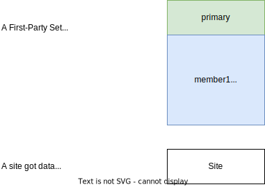
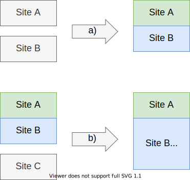

# First-Party Sets

This document proposes a new web platform mechanism to declare a collection of related domains as
being in a First-Party Set.

A [Work Item](https://privacycg.github.io/charter.html#work-items)
of the [Privacy Community Group](https://privacycg.github.io/).

## Editors:

- [Kaustubha Govind](https://github.com/krgovind), Google
- [Harneet Sidhana](https://github.com/HarneetSidhana), Microsoft 

## Participate
- https://github.com/privacycg/first-party-sets/issues

# Table of Contents

<!-- START doctoc generated TOC please keep comment here to allow auto update -->
- [Introduction](#introduction)
- [Goals](#goals)
- [Non-goals](#non-goals)
- [Use Cases](#use-cases)
- [Applications](#applications)
- [Site-Declared Sets in Browsers](#site-declared-sets-in-browsers)
- [Acceptance Process](#acceptance-process)
   - [Submission](#submission)
   - [UA Policy](#ua-policy)
   - [Verification Entity](#verification-entity)
   - [Relying solely upon Technical Enforcement](#relying-solely-upon-technical-enforcement)
   - [Administrative Controls](#administrative-controls)
- [UI Treatment](#ui-treatment)
- [Clearing Site Data on Set Transitions](#clearing-site-data-on-set-transitions)
   - [Examples](#examples)
- [Alternative designs](#alternative-designs)
   - [Origins instead of registrable domains](#origins-instead-of-registrable-domains)
- [Prior Art](#prior-art)
- [Acknowledgements](#acknowledgements)
<!-- DON'T EDIT THIS SECTION, INSTEAD RE-RUN doctoc TO UPDATE -->

# Introduction

Browsers have proposed a variety of tracking policies and privacy models
([Chromium](https://github.com/michaelkleber/privacy-model/blob/master/README.md),
[Edge](https://blogs.windows.com/msedgedev/2019/06/27/tracking-prevention-microsoft-edge-preview/),
[Mozilla](https://wiki.mozilla.org/Security/Anti_tracking_policy),
[WebKit](https://webkit.org/tracking-prevention-policy/)) which scope access to user identity to
some notion of first-party. In defining this scope, we must balance two goals: the scope should be
small enough to meet the user's privacy expectations, yet large enough to provide the user's desired
functionality on the site they are interacting with.

One natural scope is the domain name in the top-level origin. However, the website the user is
interacting with may be deployed across multiple domain names. For example, `https://google.com`,
`https://google.co.uk`, and `https://youtube.com` are owned by the same entity, as are `https://apple.com`
and `https://icloud.com`, or `https://amazon.com` and `https://amazon.de`.

We may wish to allow user identity to span related origins, where consistent with privacy requirements. For
example, Firefox ships an [entity list](https://github.com/mozilla-services/shavar-prod-lists#entity-list)
that defines lists of domains belonging to the same organization. This explainer
discusses a mechanism to allow organizations to each declare their own list of domains, which is 
then accepted by a browser if the set conforms to its policy.


# Goals

-  Allow related domain names to declare themselves as the same first-party.
-  Develop a coherent definition of "first-party" vs "third-party" for privacy mechanisms on the web platform.
-  Allow for browsers to understand the relationships between domains of multi-domain sites such that they can effectively present that information to the user.


# Non-goals

-  Making changes to web security principles such as [Same Origin Policy](https://developer.mozilla.org/en-US/docs/Web/Security/Same-origin_policy).
-  Expansion of capabilities beyond what is possible without recent browser-imposed privacy mitigations such as restrictions on third party cookies or cache partitioning.
-  Third-party sign-in between unrelated sites.
-  Information exchange between unrelated sites for ad targeting or conversion measurement.
-  Other use cases which involve unrelated sites.
-  Define specific UI treatment.

(Some of these use cases are covered by [other
explainers](https://www.chromium.org/Home/chromium-privacy/privacy-sandbox) from the Privacy
Sandbox.)

# Use Cases

On the modern web, sites span multiple domains and many sites are owned & operated by the same organization. Organizations may want to maintain different top-level domains for:

-   App domains - a single application may be deployed over multiple domains, where the user may seamlessly navigate between them as a single session.
    -   office.com, live.com, microsoft.com ([reference](https://github.com/privacycg/first-party-sets/issues/35#issue-810396040))
    -   lucidchart.com, lucid.co, lucidspark.com, lucid.app ([reference](https://github.com/privacycg/first-party-sets/issues/19#issuecomment-769277058))
-   Brand domains
    -   uber.com, ubereats.com
-   Country-specific domains to enable localization 
    -   google.co.in, google.co.uk
-   Common eTLD
    -   For example, gov.uk, and service.gov.uk are on the Public Suffix List and have UK government agencies/services as subdomains which get treated as separate registrable domains by browsers; but share services such as consent management that rely on access to cross-domain cookies. 
-   Sandbox domains that users never directly interact with, but exist to isolate user-uploaded content for security reasons. 
    -   google.com, googleusercontent.com
    -   github.com, githubusercontent.com
-   Service domains that users never directly interact with, but provide services across the same organization’s sites. 
        -   github.com, githubassets.com
        -   facebook.com, fbcdn.net

**Note:** The above have been provided only to serve as real-world illustrative assumed examples of collections of domains that are owned by the same organization; and have not all been validated with the site owners.

Without compatibility measures such as Firefox and Edge browsers’ use of [Disconnect.me’s Entities list](https://github.com/disconnectme/disconnect-tracking-protection/blob/master/entities.json), blocking cross-site communication mechanisms such as access to third-party cookies breaks many first-party use-cases.

First-Party Sets is a proposal to standardize a mechanism that solves this issue in a coherent way by declaring a collection of domains as being part of the same site or 'party'; so that they can be treated as one _privacy boundary_. This allows for browsers to enable protections against tracking across this privacy boundary, and ensures continued operation of existing functionality which would otherwise be broken by blocking cross-domain cookies (“third-party cookies”). It would support seamless operation of functionality such as:


-   Sign-in across owned & operated properties 
    -   bbc.com and bbc.co.uk
    -   sony.com and playstation.com
-   Support for embedded content from across owned & operated properties (e.g. videos/documents/resources restricted to the user signed in on the top-level site)
-   Separation of user-uploaded content from other site content for security reasons, while allowing the sandboxed domain access to authentication (and other) cookies. For example, Google sequesters such content on googleusercontent.com, GitHub on githubusercontent.com, CodePen [on](https://blog.codepen.io/2019/10/03/changed-domains-for-iframe-previews/) cdpn.io. Hosting untrusted, compromised content on the same domain where a user is authenticated may result in attackers’ potentially capturing authentication cookies, or login credentials (in case of password managers that scope credentials to domains); and cause harm to users.
    -   Alternative solution: Sandboxed domains can also consider using [partitioned cookies](https://github.com/WICG/CHIPS).
-   Shared services, such as consent management across domains with a common eTLD suffix; such as gov.uk. Repeatedly asking for cookie consent on individual gov.uk sites may be confusing to users, erode trust in the website’s functioning, and cause fatigue; because users think of all subdomains as being part of one gov.uk website.
-   Analytics/measurement of user journeys across O&O properties to improve quality of services.

# Applications

In support of the various browser privacy models, first-party sets only control when embedded content that would otherwise be considered third-party can access its own state. Examples:

-   Sites may annotate individual cookies to be sent across same-party, cross-domain contexts by using the proposed [SameParty cookie attribute](https://github.com/cfredric/sameparty).
-   An iframe’s access to its own storage should be allowed when embedded on a site within the same first-party set. For example, this would allow a `https://b.example` iframe within `https://a.example` to access its own `https://b.example` databases, which would otherwise be restricted.

Additionally, browsers may consider using First-Party Sets in new privacy features, such as:

-   Top-level key for [partitioned cookies a.k.a “chips”](https://github.com/DCtheTall/CHIPS#partition-by-top-level-context). This allows third-party sites (such as embedded SaaS providers) to provide access to the same user session across multiple top-level sites within the same first-party set ([reference use-case](https://github.com/privacycg/first-party-sets/issues/33))
-   Issuing WebID [directed identifiers](https://github.com/WICG/WebID/blob/main/directed_identifiers.md) by First-Party Set, so the same account can be shared across multiple applications or services provided by the same first-party.
-   Applying [Privacy Budget](https://github.com/bslassey/privacy-budget) across an entire First-Party Set, in order to prevent fingerprinting entropy from being accumulated across domains that are able to communicate in an unconstrained manner due to access to cross-domain, same-party cookies.
-   Top and/or second level key for cache partitioning, potentially with site opt-in.

This proposal is consistent with the same-origin policy. That is, Web Platform features must not use first-party sets to make one origin's state directly accessible to another origin in the set. For example, if a.example and b.example are in the same first-party set, the same-origin policy would still prevent `https://a.example` from accessing `https://b.example`'s cookies or IndexedDB databases.

# Site-Declared Sets in Browsers

Browsers should maintain a static list of site-declared groups of domains which meet UA ([User Agent](https://www.w3.org/WAI/UA/work/wiki/Definition_of_User_Agent)) policy, and ship it in the browser as a reliably updateable component. This is analogous to the list of [domains owned by the same entity](https://github.com/disconnectme/disconnect-tracking-protection/blob/master/entities.json) used by Edge and Firefox to control cross-site tracking mitigations.

The differences between this proposal and the use of the [Disconnect entities list](https://github.com/disconnectme/disconnect-tracking-protection/blob/master/entities.json) in Edge and Firefox are:

*   **All sites** with use-cases that depend on cross-domain, same-party communication will be required to declare a set for the corresponding group of sites. As opposed to the Disconnect list, which only applies to sites [classified as a tracker](https://github.com/disconnectme/disconnect-tracking-protection/blob/master/services.json).
*   Site authors must submit their First-Party Set declarations for acceptance (see [UA Policy](#ua-policy) for proposed documented criteria).
*   Sets will expire after a prescribed period of time, and be required to undergo renewal. This prevents sets from becoming stale, in case domain ownership changes.
*   Each set is indicated by the owner site, and member sites. 

    ```
    { owner: "https://fps-owner.example", 
      members: ["https://fps-member1.example",
      "https://fps-member2.example"]}

    ```

Technical consistency and freshness checks must be performed on the list:

*   No domain can appear in more than one set.
*   Expired sets must be removed.

Static lists are easy to reason about and easy for others to inspect. At the same time, they can develop deployment and scalability issues. Changes to the list must be pushed to each user's browser via some update mechanism. This complicates sites' ability to deploy new related domains, particularly in markets where network connectivity limits update frequency. They also scale poorly if the list gets too large. When such considerations outweigh the benefits of the lower implementation complexity of static lists, browsers may consider using the [Signed Assertions based design](signed_assertions.md) that proposes fetching sets from a `.well-known` location of the website.


# Acceptance Process

This section proposes a possible model for a First-Party Set acceptance process that could be shared across all browsers. However, many aspects of the process and policy will need to be tuned based on feedback from the web ecosystem.

## Submission

Sites will need to submit their proposed group of domains to a public tracker (such as a dedicated GitHub repository, like that of the [Public Suffix List](https://github.com/publicsuffix/list/wiki/Guidelines), and [Disconnect’s entities list](https://github.com/disconnectme/disconnect-tracking-protection/issues?q=is%3Aissue+%22entity%22+)), along with information needed to satisfy the UA policy. Technical verification of the submitter’s control over the domains may also require a challenge to be served at a `.well-known` location on each of the domains in the set.

## UA Policy

For a set of guiding principles in defining UA policy, we can look to how the various browser proposals describe first parties (emphasis added):

-   [A Potential Privacy Model for the Web (Chromium Privacy Sandbox)](https://github.com/michaelkleber/privacy-model/blob/master/README.md): "The notion of "First Party" may expand beyond eTLD+1, e.g. as proposed in First Party Sets. It is _reasonable for the browser to relax its identity-sharing controls_ within that expanded notion, provided that the resulting identity scope is _not too large_ and _can be understood by the user_."
-   [Edge Tracking Protection Preview](https://blogs.windows.com/msedgedev/2019/06/27/tracking-prevention-microsoft-edge-preview/): "Not all organizations do business on the internet using just one domain name. In order to help keep sites working smoothly, we group domains _owned and operated by the same organization_ together."
-   [Mozilla Anti-Tracking Policy](https://wiki.mozilla.org/Security/Anti_tracking_policy): "A first party is a resource or a set of resources on the web _operated by the same organization_, which is both _easily discoverable by the user_ and _with which the user intends to interact_."
-   [WebKit Tracking Prevention Policy](https://webkit.org/tracking-prevention-policy/): "A first party is a website that a user is intentionally and knowingly visiting, as displayed by the URL field of the browser, and the set of resources on the web _operated by the same organization_." and, under "Unintended Impact", "Single sign-on to multiple websites _controlled by the same organization_."

In addition, the DNT specification [defines “party” as](https://www.w3.org/TR/tracking-dnt/#terminology.participants): “a natural person, a legal entity, or a set of legal entities that share _common owner(s), common controller(s)_, and a group identity that is _easily discoverable by a user_.”

We propose the following high level policy as an initial version for discussion, subject to change based on ecosystem feedback:

-   Domains must have a common owner, and common controller.
-   Domains must share a common group identity that is easily observable by users.
-   Domains must share a common privacy policy that is surfaced to the user via [UI treatment](#ui-treatment).

We expect the UA policy to evolve over time as use cases and abuse scenarios come up. For instance, otherwise unrelated sites forming a consortium in order to expand the scope of their site identities would be considered abuse.

## Verification Entity

An independent entity must verify that submissions conform to the documented UA policy before acceptance. The entity must also assign an expiration date, following which sets are removed from the browser-baked static lists.

## Relying solely upon Technical Enforcement

Instead of having a verification entity check conformance to policy; it may be possible to rely on a combination of:

-   Self-attestation of UA Policy conformance by submitter.
-   Technical consistency checks such as verifying control over domains, and ensuring that no domain appears in more than one set.
-   Transparency logs documenting all acceptances and deletions to enable accountability and auditability.
-   Mechanism/process for the general public to report potential violations of UA Policy.

However, at this time we do not believe it is possible to enforce against the formation of consortiums of unrelated entities, and thus will require some form of verification entity to guard against that.

## Administrative controls

For enterprise usage, browsers typically offer administrators options to control web platform behavior. UA policy 
is unlikely to cover private domains, so browsers might expose administrative options for locally-defined 
first-party sets.

# UI Treatment

In order to provide transparency to users regarding the First-Party Set that a web page’s top-level 
domain belongs to, browsers may choose to present UI with information about the First-Party Set owner 
and the members list. One potential location in Chrome is the [Origin/Page Info Bubble](https://www.chromium.org/Home/chromium-security/enamel/goals-for-the-origin-info-bubble) - this 
provides requisite information to discerning users, while avoiding the use of valuable screen 
real-estate or presenting confusing permission prompts. However, browsers are free to choose different
presentation based on their UI patterns, or adjust as informed by user research.

Note that First-Party Sets also gives browsers the opportunity to group per-site controls (such as 
those at `chrome://settings/content/all`) by the “first-party” boundary instead of eTLD+1, which is 
not always the correct site boundary.

# Domain Schemes

In accordance with the [Fetch](https://fetch.spec.whatwg.org/#websocket-opening-handshake) spec, user agents must "normalize" WebSocket schemes to HTTP(S) when determining whether a particular domain is a member of a First-Party Set. I.e. `ws://` must be mapped to `http://`, and `wss://` must be mapped to `https://`, before the lookup is performed.

User agents need not perform this normalization on the domains in their static lists; user agents may reject static lists that include non-HTTPS domains.

# Clearing Site Data on Set Transitions
Sites can change which First-Party Set they are a member of. We need to pay attention to these transitions so that they don’t link user identities across all the FPSs they’ve historically been in. In particular, we must ensure that a domain cannot transfer a user identifier from one First-Party Set to another when it changes its set membership.

In order to achieve this, all site data needs to be cleared on certain transitions, including cookies, storage, cache, as well as execution contexts (documents, workers, etc.). We don’t differentiate between different types of site data because:

 * A user identifier could be stored in any of these storage types.
 * Clearing just a few of the types would break sites that expect different types of data to be consistent with each other.

The [`Clear-Site-Data: "*"`](https://www.w3.org/TR/clear-site-data/#grammardef-) specification has useful algorithms for this, but we believe it's important and safe to clear across partitions when FPS membership changes, [unlike when a site sends Clear-Site-Data](https://github.com/w3c/webappsec-clear-site-data/issues/66). 

Since member sites can only add/remove themselves to/from FPSs with the consent from the owner, we look at first-party set changes as a site changing its FPS owner.

If a site’s owner changed:

1. If this site had no FPS owner, the site's data won't be cleared.
    *   Pro: Avoids adoption pain when a site joins a FPS.
    *   Con: Unclear how this lines up with user expectations about access to browsing history prior to set formation.
2. Otherwise, clear site data of this site.

Potential modification, which adds implementation complexity:

3. If this site's new owner is a site that previously had the same FPS owner as the first site, the site's data won't be cleared. 
    *   Pro: Provides graceful transitions for examples (f) and (g).
    *   Con: Multi-stage transitions, such as (h) to (i) are unaccounted for.

## Examples



---



a. Site A and Site B create a FPS with Site A as the owner and Site B as the member. Site data will not be cleared.

b. Site C joins the existing FPS as a member site where Site A is the owner. Site data will not be cleared.

---


c. Given an FPS with owner Site A and members Site B and Site C, if Site D joins this FPS and becomes the new owner; the previous set will be dissolved and the browser will clear data for Site A, Site B and Site C.

d. Given an FPS with owner Site A and members Site B and Site C, if Site B leaves the FPS, the browser will clear site data for Site B.

e. Given two FPSs, FPS1 has owner Site A and members Site B and Site C and FPS2 has owner Site X and member Site Y, if they join together as one FPS with Site A being the owner, the browser will clear site data for Site X and Site Y.

---

With the potential modification allowing sites to keep their data if the new set owner was a previous member:


f. Given an FPS with owner Site A and members Site B and Site C, if no site is added or removed, just Site C becomes the owner and Site A becomes the member, no site data will be cleared.

g. Given an FPS with owner Site A and members Site B and Site C, if Site A leaves the FPS and Site B becomes the owner, the browser will clear site data for Site A.

h. & i. Given the FPS with owner Site A and member Site B and Site C, if Site D joins this set as a member and later becomes the owner, site data of Site A, Site B and Site C is only preserved if the user happens to visit during the intermediate stage.

# Alternative designs

## Origins instead of registrable domains

A first-party set is a collection of origins, but it is specified by registrable domains, which
carries a dependency on the [public suffix list](https://publicsuffix.org). While this is consistent
with the various proposed privacy models as well as cookie handling, the security boundary on the
web is the origin, not registrable domain.

An alternate design would be to instead specify sets by origins directly. In this model, any https
origin would be a possible first-party set owner, and each origin must individually join a set,
rather than relying on the root as we do here. For continuity with the existing behavior, we would
then define the registrable domain as the default first-party set for each origin. That is, by
default, `https://foo.example.com`, `https://bar.example.com`, and `https://example.com:444` would all be
in a set owned by `https://example.com`. Defining a set explicitly would override this default set.

This would reduce the web's dependency on the public suffix list, which would mitigate [various
problems](https://github.com/sleevi/psl-problems). For instance, a university may allow students to register arbitrary subdomains at
`https://foo.university.example`, but did not place `university.example` on the public suffix list,
either due to compatibility concerns or oversight. With an origin-specified first-party set,
individual origins could then detach themselves from the default set to avoid security problems with
non-origin-based features such as cookies. (Note the
[\_\_Host- cookie prefix](https://tools.ietf.org/html/draft-ietf-httpbis-rfc6265bis-03#section-4.1.3.2)
also addresses this issue.)

This origin-defined approach has additional complications to resolve:

-  There are a handful of features (cookies, document.domain) which are scoped to registrable
   domains, not origins. Those features should not transitively join two different sets. For
   instance, we must account for one set containing `https://foo.bar.example.com` and
   `https://example.com`, but not `https://bar.example.com`. For cookies, we can say that cookies
   remember the set which created them and we match both the Domain attribute and the first-party
   set. Thus if `https://foo.bar.example.com` sets a Domain=example.com cookie, `https://example.com`
   can read it, but not `https://bar.example.com`. Other features would need similar updates.
-  The implicit state should be expressible explicitly, to simplify rollback and deployment,
   which means first-party set manifests must describe patterns of origins, rather than a simple
   bounded list of domains. In particular, we should support subtree patterns.
-  `https://foo.example.com`'s implicit owner is `https://example.com`. If `https://example.com` then
   forms an explicit set which does not include `https://foo.example.com`, we need to change
   `https://foo.example.com`'s implicit state, perhaps to a singleton set.
-  This complex set of patterns and implicit behaviors must be reevaluated against existing
   origins every time a first-party set is updated.
-  Certificate wildcards (which themselves depend on the public suffix list) don't match an
   entire subtree. This conflicts with wanting to express implicit states above.

These complexities are likely solvable while keeping most of this design, should browsers believe
this is worthwhile.

# Prior Art

-  Firefox's [entity list](https://github.com/mozilla-services/shavar-prod-lists#entity-list)
-  [draft-sullivan-dbound-problem-statement-02](https://tools.ietf.org/html/draft-sullivan-dbound-problem-statement-02)
-  [Single Trust and Same-Origin Policy v2](https://lists.w3.org/Archives/Public/public-webappsec/2017Mar/0034.html)
   and [affiliated domains](https://www.w3.org/2017/11/06-webappsec-minutes.html#item12) from John
   Wilander to public-webappsec
   
 # Acknowledgements
 
 This proposal includes significant contributions from previous co-editor, [David Benjamin](https://github.com/davidben).
